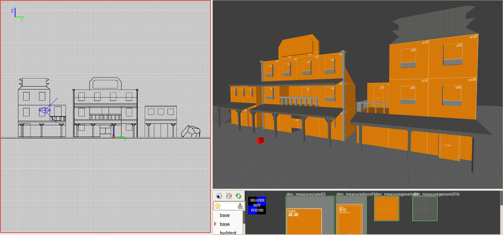
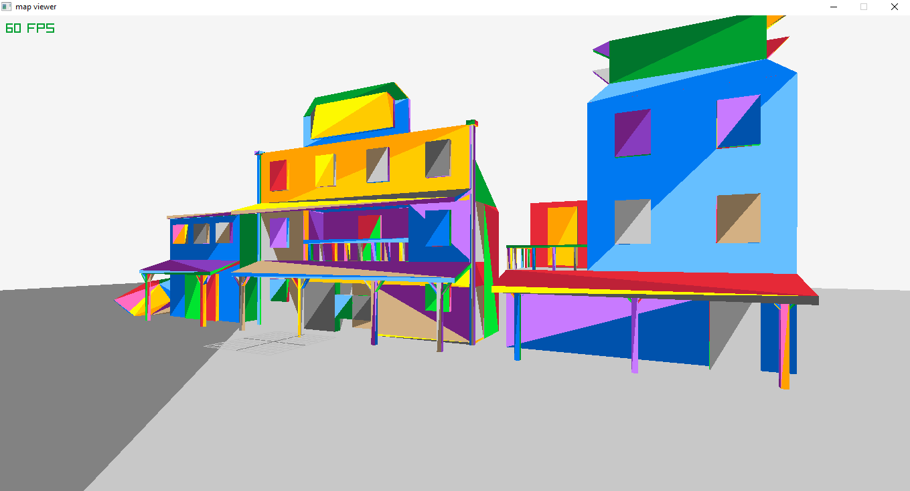

# mapviewer

A very primitive map viewer for the Quake map format written in C/C++. It is at a very unfinished state, but it should be helpful to those who want to understand the basics of calculating geometry out of raw Quake maps. It is currently able to parse simple map files and render them as randomly-colored triangles with the help of the awesome library [raylib](https://github.com/raysan5/raylib).