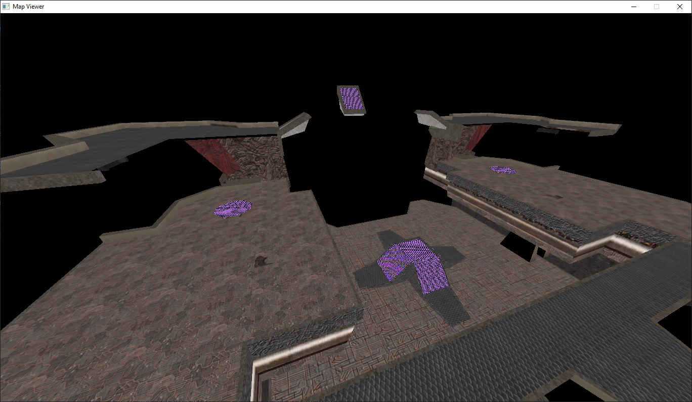

# mapviewer



## Overview

**mapviewer** is a Quake 3 Arena map file renderer written in C/C++.

## Features
- Fully-textured geometry
- Standard & Valve220 UV support
- Bezier patches

# Planned features & TODO
- Optimize GPU usage (each brush face is uploaded to the GPU individually)
- md3 model support
- Shader support
- Support for Quake, Quake 2 (and maybe Half-Life)
- BSP loading
- Proper GUI
- Exporting to other formats

# Dependencies
- glm
- PhysFS
- raylib

## Installation & Usage

Clone the repository and install dependencies:

```bash
git clone https://github.com/myuce/mapviewer.git --recurse-submodules
```

After that, you can build the project using CMake.

To load a map, you simply need to run `mapviewer path_to_map.map`. Make sure you have changed the path to your Quake 3 installation in main.cpp.
